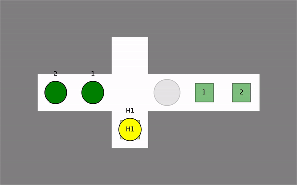

# Multi-robot Planning for Collaborative Robot Fleets in Dynamic Environments

Existing Multi-Agent Path Finding algorithms and implementations assume that the agents themselves do not bring about many changes to their environments. Although, there are applications ranging from autonomous construction, agriculture to re-configurable warehouses, where different types of agents can make changes to the environment they are operating in. Some agents can clear obstacles while others can even make obstacles. 

This repository contains implementations of 3 approaches to solve the scenarios that have agents which can move temporary obstacles to allow for other agents to reach their goal. The approaches are derived from conventional centralized algorithms, namely Prioritized Planning and Conflict-based Search.

<p align="center">




</p>

## Instructions

Build code using ```. build.sh```. This requires a minimum g++ version of 10 to build correctly. If you are on Ubuntu 20.04 and earlier, you need to install g++10 manually, and use the command ```. build_ubuntu_20.sh``` to build the project. 

Run code using ```. run.sh <solver_name> <map_name> <animation_speed> (optional to save animation)``` 

(This requires python 3.9 or later, if you have a lower version of python, please use ```. run_python3.8.sh <solver_name> <map_name> <animation_speed>``` to run your code)

Some examples commands are shown below:

Example to simply run and visualize: ```. run.sh cbs exp1_10```

Example to run and save animation: ```. run.sh prioritized exp1_10 1.0```

Example to run on an older Ubuntu version (20.04 or earlier) ```. run.sh ccbs exp1_14```